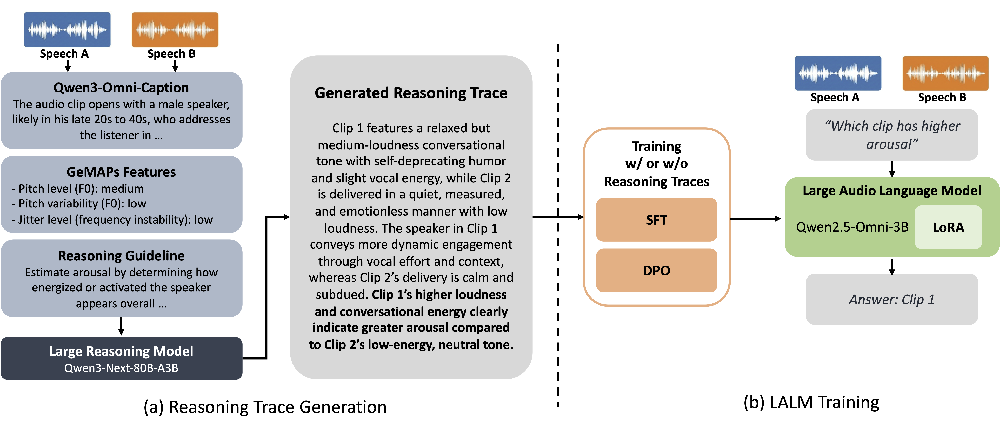

# Comparative Reasoning: Making an Audio Language Model Better at Comparing Emotions (Interspeech 2026)

[[Paper]](https://arxiv.org/abs/2606.24082) [[Project Page]](https://jaeyeonkim99.github.io/comparative_reasoning/) [[Reasoning Traces]](https://huggingface.co/datasets/Lab-MSP/comparative-reasoning-traces) [[Checkpoints]](#checkpoints)

Official code and data for **Comparative Reasoning: Making an Audio Language Model Better at Comparing Emotions (Interspeech 2026)**,



## Abstract

Large audio-language models (LALMs) can reason about audio, yet it remains unclear whether they can perform comparative judgments between two speech signals along emotional, environmental, linguistic, prosodic, and interpersonal dimensions. We study this question in the context of speech emotion recognition (SER), where the model determines which utterance exhibits higher arousal, valence, or dominance. We introduce a reasoning-guided ordinal SER framework that conditions an LALM on paired speech inputs. The model is trained using reasoning traces generated from both semantic audio descriptions and acoustic evidence derived from GeMAPS features, enabling interpretable comparative decisions. Beyond direct supervision, we also employ direct preference optimization to encourage stronger separation for emotional differences. Experiments show that the proposed framework improves preference prediction while requiring only 5% of the training data used by conventional ordinal SER systems.

## Results

Preference accuracy (%) of Qwen2.5-Omni-3B fine-tuned on 10k MSP-Podcast pairs per attribute. BIIC-Podcast and WHiSER are unseen corpora (averaged over the three attributes).

| Model | Arousal | Valence | Dominance | **MSP-Podcast Avg** | BIIC-Podcast | WHiSER |
|---|---|---|---|---|---|---|
| Qwen2.5-Omni-3B (zero-shot) | 65.8 | 70.7 | 54.7 | 63.7 | 57.2 | 67.7 |
| + SFT | 88.1 | 87.8 | **86.7** | 87.5 | 76.0 | 89.8 |
| + SFT-CoT | 85.5 | 86.5 | 84.6 | 85.5 | 74.1 | 85.4 |
| + DPO | 88.5 | 88.8 | 86.3 | 87.9 | 75.7 | **91.1** |
| + **DPO-CoT** | **88.7** | **89.0** | **86.7** | **88.1** | **77.0** | 90.9 |

## Repository structure

```
pairs/                  Preference pairs (released with this repository)
  msp_podcast/          MSP-Podcast v2.0: Train 10k / Development 3k / Test1 3k pairs per attribute
  biic_podcast/         BIIC-Podcast test pairs (1k per attribute)
  whiser/               WHiSER test pairs (1k per attribute)
data/
  prompts.py            Question / attribute definitions shared by training data and evaluation
  preprocess/           Audio captioning and GeMAPS-36 feature extraction
  reasoning/            Reasoning trace generation, verification, and merging
  post_process/         Conversion into ms-swift SFT / DPO data
src/
  sft_swift.sh          SFT / SFT-CoT training
  dpo_swift.sh          DPO / DPO-CoT training
  eval.sh, eval_vllm.py Evaluation with vLLM
  summarize.py          Aggregates results into a CSV
```

All scripts are run from the repository root.

## Data

### Preference pairs

Each CSV in `pairs/` has the columns `sen1, sen2, preference, split`. `preference = 1` means `sen1` (Clip 1) has the higher attribute value, `0` means `sen2` (Clip 2) does. Pairs are built from utterances whose consensus attribute scores differ by more than 1 on the 1–7 scale, and no utterance is shared between splits. `<attribute>_mini_valid.csv` is the 1k-pair subset of the Development pairs used for checkpoint selection.

The CSVs reference audio by file name only. Obtain the audio from the original corpora under their licenses: [MSP-Podcast](https://lab-msp.com/MSP/MSP-Podcast.html), [BIIC-Podcast](https://biic.ee.nthu.edu.tw/) (available on request from the BIIC Lab, NTHU), and [WHiSER](https://huggingface.co/datasets/Lab-MSP/whiser_parquet).

### Reasoning traces

The verified reasoning traces used to train SFT-CoT and DPO-CoT are available on [Hugging Face](https://huggingface.co/datasets/Lab-MSP/comparative-reasoning-traces). With them you can skip the trace generation below and go directly to [Training](#training). To regenerate them, see [data/README.md](data/README.md).

## Setup

Training and evaluation use [ms-swift](https://github.com/modelscope/ms-swift) and [vLLM](https://github.com/vllm-project/vllm). We recommend the [official ms-swift docker images](https://swift.readthedocs.io/en/latest/GetStarted/SWIFT-installation.html#mirror), which include vLLM. Our experiments used ms-swift 3.12.1 (`modelscope:ubuntu22.04-cuda12.8.1-py311-torch2.9.0-vllm0.13.0-modelscope1.33.0-swift3.12.1`). For the data generation pipeline:

```bash
pip install -r requirements.txt
```

Set the audio directories (`/path/to/...`) in `src/eval.sh` and pass `--audio_dir` to the data scripts.

## Training

### 1. Build the ms-swift training data

```bash
# Download the reasoning traces (or build them with data/reasoning/build_traces.py)
huggingface-cli download Lab-MSP/comparative-reasoning-traces --repo-type dataset --local-dir outputs/traces_hf

AUDIO=/path/to/msp_podcast/Audios
python -m data.post_process.make_swift_data -f sft -a $AUDIO -o outputs/swift/sft.jsonl
python -m data.post_process.make_swift_data -f dpo -a $AUDIO -o outputs/swift/dpo.jsonl
python -m data.post_process.make_swift_data -f sft -t outputs/traces_hf/data -a $AUDIO -o outputs/swift/sft_cot.jsonl
python -m data.post_process.make_swift_data -f dpo -t outputs/traces_hf/data -a $AUDIO -o outputs/swift/dpo_cot.jsonl
```

### 2. Train

LoRA (rank 64, alpha 128) on all linear layers of Qwen2.5-Omni-3B, 10 epochs, total batch size 32.

```bash
bash src/sft_swift.sh outputs/swift/sft.jsonl
bash src/sft_swift.sh outputs/swift/sft_cot.jsonl
bash src/dpo_swift.sh outputs/swift/dpo.jsonl
bash src/dpo_swift.sh outputs/swift/dpo_cot.jsonl
```

For the cross-emotion experiment (train on arousal, evaluate on all attributes), pass only `pairs/msp_podcast/arousal_preference.csv` to `make_swift_data.py` with `-i`.

## Evaluation

```bash
bash src/eval.sh msp_valid $CKPT_PATH             # checkpoint selection (Development)
bash src/eval.sh msp_test  $CKPT_PATH             # MSP-Podcast Test1 (main table)
bash src/eval.sh biic      $CKPT_PATH             # BIIC-Podcast (cross-domain)
bash src/eval.sh whiser    $CKPT_PATH             # WHiSER (cross-domain)
bash src/eval.sh msp_test  Qwen/Qwen2.5-Omni-3B   # zero-shot baseline
```

`$CKPT_PATH` is a LoRA checkpoint directory, e.g. `outputs/experiments/<run_name>/checkpoint-<step>`, or an adapter downloaded from Hugging Face; `msp_valid` also accepts several checkpoints at once. LoRA checkpoints are merged into the base model on first use. Results are written to `outputs/results/<benchmark>/` and summarized in `outputs/results/<benchmark>_summary.csv`.

## Checkpoints

| Model | Link |
|---|---|
| SFT | [Lab-MSP/comparative-reasoning-sft](https://huggingface.co/Lab-MSP/comparative-reasoning-sft) |
| SFT-CoT | [Lab-MSP/comparative-reasoning-sft-cot](https://huggingface.co/Lab-MSP/comparative-reasoning-sft-cot) |
| DPO | [Lab-MSP/comparative-reasoning-dpo](https://huggingface.co/Lab-MSP/comparative-reasoning-dpo) |
| DPO-CoT | [Lab-MSP/comparative-reasoning-dpo-cot](https://huggingface.co/Lab-MSP/comparative-reasoning-dpo-cot) |

The checkpoints are LoRA adapters for [Qwen/Qwen2.5-Omni-3B](https://huggingface.co/Qwen/Qwen2.5-Omni-3B) and follow its license.

## Citation

```bibtex
@inproceedings{naini2026comparative,
  title     = {Comparative Reasoning: Making an Audio Language Model Better at Comparing Emotions},
  author    = {Naini, Abinay Reddy and Kim, Jaeyeon and Yang, Chao-Han Huck and Watanabe, Shinji and Busso, Carlos},
  booktitle = {Interspeech},
  year      = {2026}
}
```

## License

The code is released under the [MIT License](LICENSE). The preference pairs in `pairs/` and the released reasoning traces are derived from MSP-Podcast, BIIC-Podcast, and WHiSER; their use is subject to the licenses of the original corpora.
